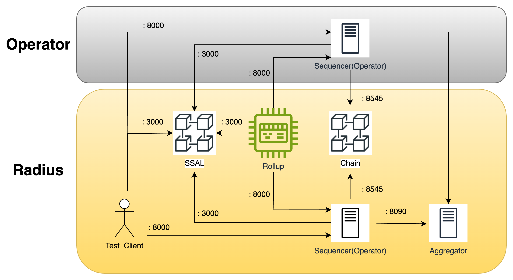

# Overview


# Walkthrough

## Prerequisites (Ubuntu 22.04 Jammy)
1. Install rust
```
curl --proto '=https' --tlsv1.2 -sSf https://sh.rustup.rs | sh
```
2. Install Go according to the instruction from the link: https://go.dev/doc/install

3. Install dependencies
```
# Install libraries.
sudo apt install build-essential clang libssl-dev pkg-config -y

# Install foundry
curl -L https://foundry.paradigm.xyz | bash
foundryup

# Install zap-pretty
go install github.com/maoueh/zap-pretty@latest
```

4. Clone the SSAL repositories
```
git clone -b ssal-avs --recursive https://github.com/radiusxyz/ssal
```

5. Build
```
cd ssal
cargo build --release
```

## Deployment
Please follow the instructions below in order.

#### 1. Run the operator
In order to run the operator we need to change configurations at:
```
ssal/ssal-avs/config-files/operator.anvil.yaml
```

***CAVEAT***

`operator.anvil.yaml` file needs to change if the operator is already registered to the aggregator.

**Cold Start**

Open the file with the editor of your choice and change `eth_rpc_url`, `eth_ws_url`,`aggregator_server_ip_port_address` and `register_operator_on_startup` to followings:
```
eth_rpc_url: http://3.38.183.158:8545
eth_ws_url: ws://3.38.183.158:8545

aggregator_server_ip_port_address: 3.38.183.158:8090

register_operator_on_startup: true
```

**Re-Run**

When a validator wants to re-run the operator after the successful registration of
the operator, open the file and change the `register_operator_on_startup` to the following:
```
register_operator_on_startup: false
```

Change the directory to `/ssal/ssal-avs` and run the following command:
```
make start-operator
```

#### 2. Run the sequencer
Change the sequencer configuration at `ssal/configs/ssal-sequencer.toml` with the editor of your preference
By default the configs are as the following:
```
ssal_url = "http://127.0.0.1:3000"
rollup_id = "1"
chain_url = "http://127.0.0.1:8545"
wallet_private_key = "Your Wallet Private Key"
is_local_deployment = true
```

Change the `is_local_deployment` field to false and run the following command:
```
./target/release/ssal-sequencer
```

After a successful launch, the following log will show up:
```
INFO ssal_sequencer::task: [RegisterSequencer]: Successfully registered for RollupId("1"): BlockHeight(192)
```

At this point, our sequencers are successfully registered at each rollup's sequencer pool and randomly become a leader to build a block. Because we are not sending any transaction to the sequencer, the block is empty now. Let's move onto launching test clients to send transactions to be included in our rollups.

#### 3. Run the client
Now we can run the test-client to send transactions to rollups.
```
# Usage:
./target/release/ssal-client "SSAL-URL" "ROLLUP-ID"

# Examples:
// Run test-client for Rollup ID = 1
./target/release/ssal-client http://3.38.183.158:3000 1

// Run test-client for Rollup ID = 2
./target/release/ssal-client http://3.38.183.158:3000 2

// Run test-client for Rollup ID = 3
./target/release/ssal-client http://3.38.183.158:3000 3
```

#### 4. Query using a web browser.
Now everything is up and running, we can query things using a web browser.

Query the block:
```
# Usage:
"SEQUENCER-URL"/get-block?rollup_id="ROLLUP-ID"&block_height="BLOCK-HEIGHT"

# Examples:
// Get the block with height = 48 for Rollup ID = 1 from the sequencer listening to port 8001.
http://127.0.0.1:8001/get-block?rollup_id=1&block_height=50

// Get the block with height = 96 for Rollup ID = 2 from the seqencer listening to port 8003.
http://127.0.0.1:8003/get-block?rollup_id=2&block_height=96
```

Query the block commitment:
```
# Usage:
"SEQUENCER-URL"/get-block-commitment?rollup_id="ROLLUP-ID"&block_height="BLOCK-HEIGHT"

# Examples:
// Get the block commitment of the block with height = 50 for Rollup ID = 1 from the sequencer listening to port 8001.
http://127.0.0.1:8001/get-block-commitment?rollup_id=1&block_height=50

// Get the block commitment of the block with height = 96 for Rollup ID = 2 from the sequencer listening to port 8003.
http://127.0.0.1:8003/get-block-commitment?rollup_id=2&block_height=96
```

Query the sequencer set:
```
# Usage:
"SSAL-URL"/get-closed-sequencer-set?rollup_id="ROLLUP-ID"&block_height="BLOCK-HEIGHT"

# Examples:
// Get the sequencer set for the block with height = 48 for Rollup ID = 1.
http://3.38.183.158:3000/get-closed-sequencer-set?rollup_id=1&block_height=48

// Get the sequencer set for the block with height = 96 for Rollup ID = 2.
http://3.38.183.158:3000/get-closed-sequencer-set?rollup_id=2&block_height=96
```
